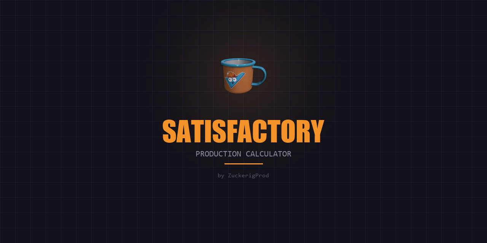

# Satisfactory — Production Calculator



A production chain calculator for the game **Satisfactory**. Created by **[ZuckerigProd](https://t.me/ZuckerigProd)** to help plan your factory with ease.

## Features

- Recursive production chain calculation with all game recipes
- 2D interactive production map with draggable nodes
- 170 parts, 332 recipes, 40 machines from game data
- Alternate recipe selection
- Miner tier support (Mk.1 / Mk.2 / Mk.3)
- Chain saving to localStorage
- English and Russian languages
- Game icons for all items

## Support the project

If you'd like to support the project:

<a href="https://www.donationalerts.com/r/zuckerigprod">
  
</a>

## Getting started

```bash
npm install
npm run dev
```

Open `http://localhost:3000`

## Build

```bash
npm run build
```

---

# Satisfactory — Калькулятор производства

Калькулятор производственных цепочек для игры **Satisfactory**. Создано **[ZuckerigProd](https://t.me/ZuckerigProd)**, чтобы вам было проще планировать свою фабрику.

## Возможности

- Рекурсивный расчёт производственных цепочек со всеми рецептами из игры
- 2D интерактивная карта производства с перемещаемыми блоками
- 170 предметов, 332 рецепта, 40 машин из данных игры
- Выбор альтернативных рецептов
- Поддержка тиров буров (Mk.1 / Mk.2 / Mk.3)
- Сохранение цепочек в localStorage
- Русский и английский языки
- Игровые иконки для всех предметов

## Поддержать проект

Если хотите поддержать — буду благодарен:

<a href="https://www.donationalerts.com/r/zuckerigprod">
  
</a>

## Запуск

```bash
npm install
npm run dev
```

Открыть `http://localhost:3000`

## Сборка

```bash
npm run build
```
